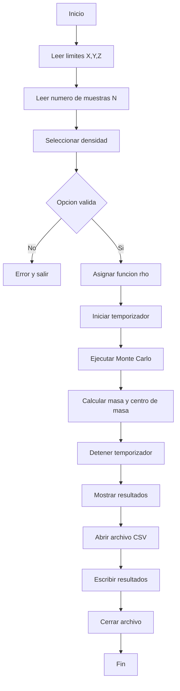

# Proyecto: Cálculo de Masa y Centro de Masa mediante Monte Carlo

Este proyecto implementa el cálculo de **masa total** y **centro de masa** de un cuerpo tridimensional definido dentro de una **región rectangular**, utilizando el **método de Monte Carlo**. El programa permite seleccionar distintas funciones de densidad y genera además un registro en archivo CSV.

---

## **Descripción General del Método**

El método de Monte Carlo aproxima integrales en 3D generando puntos aleatorios dentro de una **región rectangular** definida por:

```
x_min ≤ x ≤ x_max
y_min ≤ y ≤ y_max
z_min ≤ z ≤ z_max
```

Esta región forma un paralelepípedo sobre el cual se calcula la masa y el centro de masa:

[ \int_R f(x,y,z) , dV \approx V \cdot \frac{1}{N} \sum_{i=1}^N f(x_i, y_i, z_i) ]

Para este proyecto, se calculan:

* **Masa total:**
  [ M = \int_R \rho(x,y,z) , dV ]

* **Centro de masa:**

  El centro de masa en 3D se define mediante:

  ```
  x_bar = (1/M) ∫_R x * ρ(x,y,z) dV
  y_bar = (1/M) ∫_R y * ρ(x,y,z) dV
  z_bar = (1/M) ∫_R z * ρ(x,y,z) dV
  ```

---

##  **Estructura del Proyecto**

```
Proyecto/
│
├── include/
│   ├── densidades.h
│   └── integracion.h
│
├── src/
│   ├── main.c
│   ├── densidades.c
│   └── integracion.c
│
├── resultados.csv   (se genera automáticamente)
└── Makefile
```

---

##  **Compilación**

Asegúrese de estar en la carpeta raíz del proyecto y ejecute:

```
make
```

Esto generará el ejecutable:

```
./programa_vectorial
```

Para limpiar archivos temporales:

```
make clean
```

Para compilar y ejecutar en un solo paso:

```
make run
```

---

##  **Ejecución del Programa**

El programa solicita al usuario:

1. Límites en **x**, **y**, **z**
2. Número de puntos de muestreo **N**
3. Tipo de densidad:

   * 1 → Constante
   * 2 → Lineal
   * 3 → Gaussiana

Ejemplo típico:

```
Ingrese limites X (min max): -1 1
Ingrese limites Y (min max): -1 1
Ingrese limites Z (min max): -1 1
Numero de muestras N: 500000
Seleccione densidad: 3
```

El programa calcula:

* Masa total
* Coordenadas del centro de masa
* Tiempo de ejecución

Y finalmente **guarda los resultados en** `resultados.csv`.

---

##  **Funciones de Densidad Incluidas**

* **Constante:** ρ = 1
* **Lineal:** ρ = x + y + z
* **Gaussiana:** ρ = exp(−(x² + y² + z²))

Estas funciones están implementadas en `densidades.c` y son seleccionables desde el menú.

---

##  **Archivo CSV**

Cada ejecución agrega una línea:

```
Metodo, Densidad, Nx, Ny, Nz, M, cx, cy, cz, Tiempo
```

Ejemplo:

```
MonteCarlo,Gaussiana,500000,500000,500000,12.345000,0.012300,0.010200,-0.003400,0.527100
```

---

##  Diagrama de Flujo



---

##  **Objetivos Cumplidos según el PDF**

* Separación en módulos (`src/`, `include/`)
* Métodos numéricos en archivos dedicados
* Uso de punteros a funciones para densidades
* Programación limpia y verificable
* Exportación de resultados en CSV
* Inclusión de un `Makefile` funcional

---

## 👤 **Autor**

Mateo Cárdenas.
